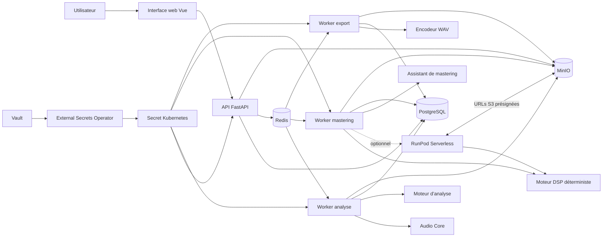
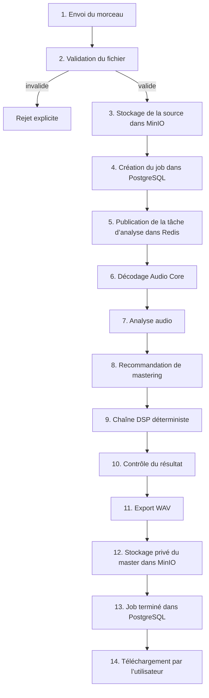

# Fonctionnement d’OpenMaster et traitement d’un morceau

Ce document explique l’architecture d’OpenMaster, le rôle de chaque composant et le
parcours d’un morceau étape par étape. L’upload, l’analyse asynchrone, la recommandation,
le mastering, l’export WAV et le téléchargement sont reliés dans le parcours web
mono-fichier.

## Vue d’ensemble



### Rôle des composants

| Composant | Rôle |
| --- | --- |
| Interface web | Sélection du morceau, lancement d’un job et affichage de son état |
| API | Validation des requêtes, création et consultation des jobs |
| PostgreSQL | État persistant des jobs et métadonnées |
| Redis | File de tâches Celery et résultats techniques temporaires |
| MinIO | Stockage des fichiers source, intermédiaires et exports |
| Worker analyse | Décodage et mesure du morceau |
| Worker mastering | Décision de mastering et rendu DSP |
| Worker export | Encodage et publication du fichier final |
| Vault et External Secrets | Injection des identifiants sans les stocker dans Helm |

## Parcours web implémenté



### 1. Envoi du morceau

L’utilisateur choisit un fichier depuis l’interface. Le navigateur l’envoie à
`POST /api/v1/analysis-jobs` avec une clé d’idempotence, puis interroge
`GET /api/v1/analysis-jobs/{id}`. Le fichier audio ne doit jamais être placé dans les
logs.

### 2. Validation

Avant tout traitement, OpenMaster vérifie notamment :

- que le chemin ou le fichier est valide ;
- que le format est pris en charge ;
- que sa taille et sa durée restent sous les limites configurées ;
- que le flux possède une fréquence d’échantillonnage et des canaux valides ;
- que les échantillons décodés sont finis et exploitables.

Les WAV PCM 8/16/24/32 bits et WAV flottants 32/64 bits sont décodés directement.
AIFF, FLAC, M4A, MP3, OGG et Opus passent par FFmpeg/FFprobe.

### 3. Stockage de la source

Le fichier validé est stocké dans MinIO. La base
de données conserve uniquement son identifiant, son état et ses métadonnées ; elle ne
contient pas l’audio.

### 4. Création du job

PostgreSQL enregistre le job avec un UUID et un état initial. Les transitions sont
persistantes et auditables :

```text
queued -> running -> mastering -> succeeded
                \        \          \-> failed
                 \---------> failed
```

### 5. Mise en file

L’API envoie une tâche dans Redis. Les files Celery sont isolées :

- `analysis` pour les mesures ;
- `mastering` pour le rendu ;
- `export` pour la création du fichier livré.

Les tâches sont conçues pour être relançables sans produire plusieurs résultats
incohérents.

### 6. Décodage

`audio_core` transforme la source en échantillons normalisés `float64` et fournit les
métadonnées : fréquence d’échantillonnage, nombre de canaux, durée et profondeur
encodée lorsqu’elle est connue.

Un workflow composé réutilise ce flux décodé pour éviter un second décodage et des
copies mémoire inutiles.

### 7. Analyse audio

Le moteur d’analyse calcule notamment :

- LUFS intégré ;
- RMS, peak et true peak estimé ;
- dynamique et facteur de crête ;
- BPM et tonalité ;
- largeur stéréo et corrélation de phase ;
- centroïde spectral ;
- durée, fréquence d’échantillonnage et profondeur de bits.

Le résultat est typé et sérialisable. Les mesures sont déterministes pour une même
entrée et une même version du moteur.

### 8. Décision de mastering

L’assistant produit une recommandation explicable. Il peut proposer une cible de
sonie et signaler un manque de headroom ou un risque de phase, mais il ne modifie pas
secrètement le signal.

La décision contient les paramètres retenus, les limites de sécurité, la confiance et
les raisons ayant conduit à la recommandation.

### 9. Rendu DSP

Le moteur DSP reste déterministe. Le socle actuellement implémenté applique :

1. un gain statique borné à partir de la cible de sonie ;
2. une réduction de ce gain si le headroom mesuré est insuffisant ;
3. un limiteur sample-peak lié entre les canaux ;
4. une trace ordonnée des processeurs et paramètres appliqués.

Pour les stems alignés, tous les stems reçoivent le même gain et la même enveloppe de
limitation afin de préserver leur équilibre et leur somme.

### 10. Contrôle du résultat

Le pipeline contrôle l’absence de valeurs non finies et le respect des bornes
d’échantillons. Le limiteur actuel protège les sample peaks ; il ne constitue pas
encore une garantie réglementaire de true peak ou de conformité à une plateforme.

### 11. Export

Le master est encodé en WAV PCM 16, 24 ou 32 bits. L’écriture est atomique : le fichier
temporaire n’est remplacé par le résultat final qu’après réussite complète. Un fichier
existant n’est jamais écrasé sans option explicite.

### 12 à 14. Publication et téléchargement

Dans le parcours web actuel, le worker de mastering encode le WAV, place le master
dans MinIO et marque le job terminé dans PostgreSQL. L’API fournit ensuite une
redirection vers une URL MinIO présignée de courte durée. Le worker d’export séparé
reste réservé aux futurs formats et politiques de livraison.

## Ce qui fonctionne actuellement

Le moteur local est opérationnel pour :

- analyser un fichier ;
- produire une décision de mastering déterministe ;
- rendre et exporter un master WAV ;
- fournir les recommandations de l’assistant ;
- comparer un morceau à une référence ;
- traiter un groupe de stems alignés.

Exemple de traitement local complet :

```bash
python -m packages.dsp_engine mix.wav master.wav --target-lufs -14
```

Le résultat JSON contient l’analyse, la politique, la décision effective, le chemin
d’export et l’ordre des processeurs.

Autres points d’entrée :

```bash
python -m packages.analysis_engine mix.wav
python -m packages.mastering_assistant mix.wav --target-lufs -14
python -m packages.reference_matching mix.wav reference.wav
python -m packages.stem_mastering --mix mix.wav \
  --stem drums=drums.wav \
  --stem music=music.wav \
  --output-dir mastered-stems
```

## Limites actuelles de l’interface web

Le chart k3s déploie le flux distribué mono-fichier complet :
upload → MinIO → PostgreSQL → Celery → analyse → mastering → téléchargement.

Les fonctions spécialisées suivantes existent dans les packages et les CLI mais
nécessitent encore leurs propres écrans et contrats API :

- comparaison avec un morceau de référence, qui reçoit deux fichiers ;
- mastering de stems alignés, qui reçoit un groupe nommé de fichiers ;
- sélection et configuration de plugins externes, qui exige un modèle de permissions
  et ne doit pas accepter une commande arbitraire depuis le navigateur.

## Garanties de conception

- Le DSP est déterministe et reproductible.
- L’assistant recommande des réglages sans cacher les opérations audio.
- Le CPU reste toujours utilisable ; le GPU est optionnel et explicitement demandé.
- Les workers sont isolés par file et configurés pour des tâches relançables.
- Les secrets proviennent de Vault ou d’un Secret Kubernetes existant.
- Les fichiers audio et les valeurs secrètes ne doivent jamais apparaître dans les logs.
- Les traitements lourds peuvent être délégués explicitement à RunPod, avec repli CPU
  local conservé comme chemin indépendant.
