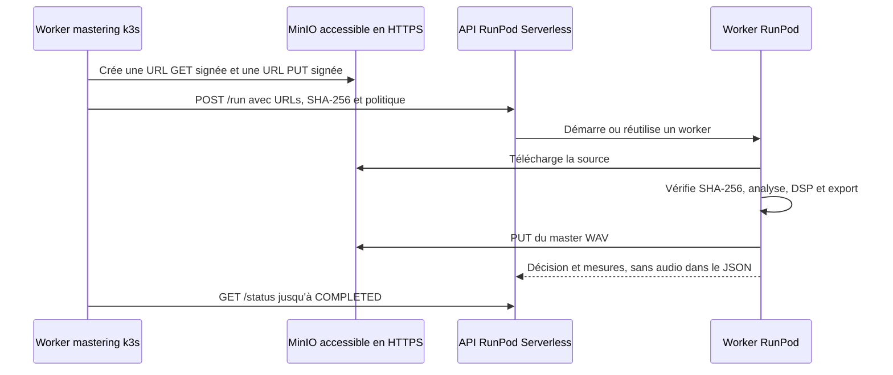

# Déporter les traitements lourds vers RunPod

Pour une installation complète, suivez le
[runbook RunPod + k3s + Vault](runpod-k3s-vault.fr.md).

OpenMaster peut conserver son plan de contrôle léger sur k3s et déléguer les traitements
de mastering à un endpoint RunPod Serverless. Le backend CPU local reste disponible :
RunPod est une option explicite, jamais un remplacement silencieux.

## Architecture



Les fichiers audio ne sont pas placés dans le payload RunPod : l’API queue-based limite
les requêtes synchrones à 20 Mio et ne conserve les résultats asynchrones que
temporairement. OpenMaster utilise donc des URL HTTPS signées à courte durée et conserve
le résultat durablement dans le stockage objet.

## Limite actuelle

Le client, le worker distant, l’Ingress S3 MinIO et le contrat de sécurité sont
implémentés. La tâche `openmaster.remote_mastering_minio` génère les URLs présignées
depuis deux noms d’objets MinIO et délègue le traitement à RunPod. Le raccordement de
cette tâche au futur workflow web upload/job reste à réaliser.

Le pipeline actuel est surtout numérique et déterministe ; il ne contient pas encore
un grand modèle d’IA. Une GPU RunPod n’accélérera donc pas toutes les opérations
existantes. Cette frontière est prête à accueillir les futurs modèles ONNX/PyTorch et
les traitements GPU sans augmenter la RAM réservée sur k3s.

## Construire le worker

```bash
export REGISTRY=registry.example.com/openmaster
export VERSION=2.3.1

docker build -f Dockerfile.runpod -t "${REGISTRY}/runpod:${VERSION}" .
docker push "${REGISTRY}/runpod:${VERSION}"
```

Dans RunPod, créez un endpoint Serverless queue-based depuis cette image :

- workers Flex ;
- minimum workers : `0` pour revenir à zéro au repos ;
- maximum workers : `1` au départ ;
- matériel économique au départ ; choisissez une GPU seulement lorsqu’un backend
  PyTorch/ONNX/CuPy compatible est ajouté à l’image ;
- délai d’exécution supérieur à la durée maximale d’un mastering.

L’image fournie privilégie actuellement Python 3.12 et le traitement distant fiable,
sans prétendre utiliser CUDA. Lorsqu’un modèle IA GPU sera intégré, remplacez sa base
par une image CUDA/PyTorch compatible avec Python 3.12 et verrouillez les versions du
framework et du pilote.

Le mode Flex est facturé à la seconde et revient à zéro lorsqu’il est inactif. Un worker
actif réduit la latence mais reste facturé en permanence.

## Variables du worker RunPod

Configurez dans l’interface RunPod :

```text
OPENMASTER_ALLOWED_STORAGE_HOSTS=s3.example.com
OPENMASTER_MAX_REMOTE_BYTES=268435456
```

`OPENMASTER_ALLOWED_STORAGE_HOSTS` est obligatoire et accepte une liste séparée par des
virgules. Elle empêche un job falsifié d’utiliser le worker pour contacter un autre
hôte. Le stockage doit être accessible depuis Internet en HTTPS ; n’exposez pas la
console MinIO et utilisez des URL signées de courte durée.

## Configuration k3s

Ajoutez `RUNPOD_API_KEY` au Secret déjà géré par Vault :

```text
RUNPOD_API_KEY=REPLACE_WITH_RUNPOD_API_KEY
```

Ne placez jamais cette clé dans les valeurs Helm. Copiez ensuite l’exemple :

```bash
cp deployment/examples/values-runpod.example.yaml /tmp/values-runpod.yaml
```

Remplacez `remoteCompute.endpointId`. Superposez ce fichier à vos valeurs ou recopiez
son bloc dans le fichier utilisé par `VALUES`.

La NetworkPolicy Kubernetes standard ne sait pas autoriser un FQDN. L’exemple autorise
donc uniquement TCP/443 depuis le worker de mastering vers `0.0.0.0/0`. C’est un choix
explicite nécessaire si les IP de RunPod changent. Pour une restriction par domaine,
utilisez un CNI supportant les politiques FQDN ou un proxy egress.

## Contrat d’un job

```json
{
  "input": {
    "source_url": "https://s3.example.com/source.wav?signature=...",
    "destination_url": "https://s3.example.com/master.wav?signature=...",
    "source_sha256": "64-caracteres-hexadecimaux",
    "target_lufs": -14.0,
    "maximum_gain_adjustment_db": 12.0,
    "ceiling_dbfs": -1.0,
    "bit_depth": 24
  }
}
```

Le worker refuse HTTP, les identifiants intégrés à l’URL, les hôtes non autorisés, un
format inconnu, un fichier trop grand ou un SHA-256 incorrect. Il diffuse le
téléchargement et l’upload par blocs afin de ne pas charger le fichier encodé une
seconde fois en mémoire.

## Maîtrise des coûts

- Commencez avec un worker Flex, minimum `0`, maximum `1`.
- Limitez `OPENMASTER_MAX_REMOTE_BYTES`.
- Fixez `executionTimeout` et `ttl` ; le client utilise respectivement 1 h et 2 h.
- Configurez les alertes et limites de dépenses RunPod.
- N’attachez un volume réseau que lorsqu’un modèle volumineux doit être mis en cache.
- Conservez une seule tentative applicative idempotente par objet de destination.

RunPod facture le Serverless à la seconde d’activité. Les tarifs varient selon la GPU ;
consultez toujours la grille officielle avant de sélectionner le matériel.
